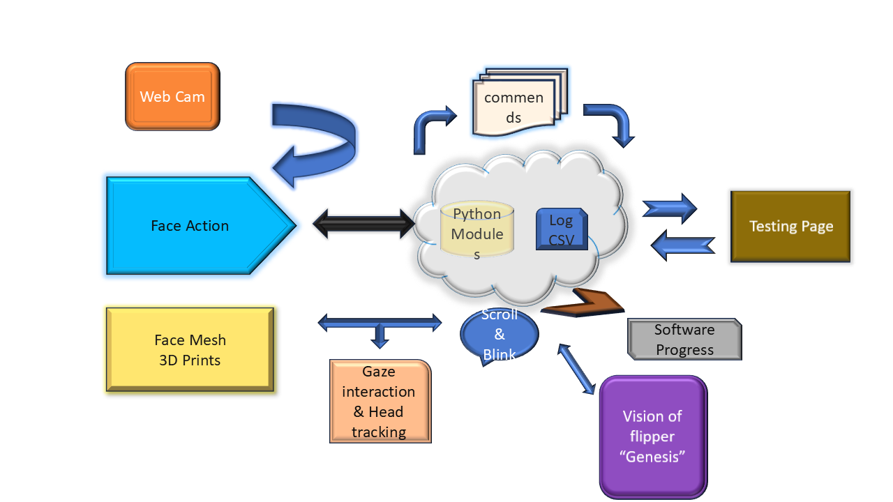

# 👁️ Eye-Blink & Head-Movement Tracking Mouse

This project enables users to control their mouse using **eye blinks** and **head movement**. It uses computer vision and AI libraries such as MediaPipe, OpenCV, and dlib to track facial landmarks and estimate gaze direction and head orientation. The project also includes a Flask web interface.

---
<div style="display: flex; justify-content: center; flex-wrap: wrap; gap: 10px;">

  

</div>


## 🆕 Rebuilt Version (2024 - 25)

> 🔥 The **old version** has been destroyed.  
> 🚀 This is the **new, undestroyable** and optimized version with improved stability, modular code, and real-time performance.

Author: Dheenadhayalan G
📧 Email: gdheenadhayalan165@gmail.com
---

## 📦 Features

- Real-time head pose and eye-tracking using webcam
- Cursor control based on gaze estimation
- Blink detection for mouse clicks
- Normalized pitch angle processing
- Logs gaze and orientation data to CSV
- Web interface with `index.html` for live interaction

---

## 🛠️ Technologies Used

- Python
- OpenCV
- MediaPipe
- dlib
- pyautogui
- Flask
- pynput

---

## 🗂️ Project Structure
Eye-Blink-Head-movement-Tracking-Mouse/
│
├── app.py # Flask backend for live tracking and UI
├── templates/
│ └── index.html # Frontend interface
├── AngleBuffer.py # Custom class for angle smoothing
├── requirements.txt # Python package dependencies
├── README.md # You're here!
└── (Other Python modules) # e.g. tracking, logic, control functions


---

## 🚀 Getting Started

### 1. Clone the repository

```bash
git clone https://github.com/Dhayalan66-G/Eye-Blink-Head-movement-Tracking-Mouse.git
cd Eye-Blink-Head-movement-Tracking-Mouse
